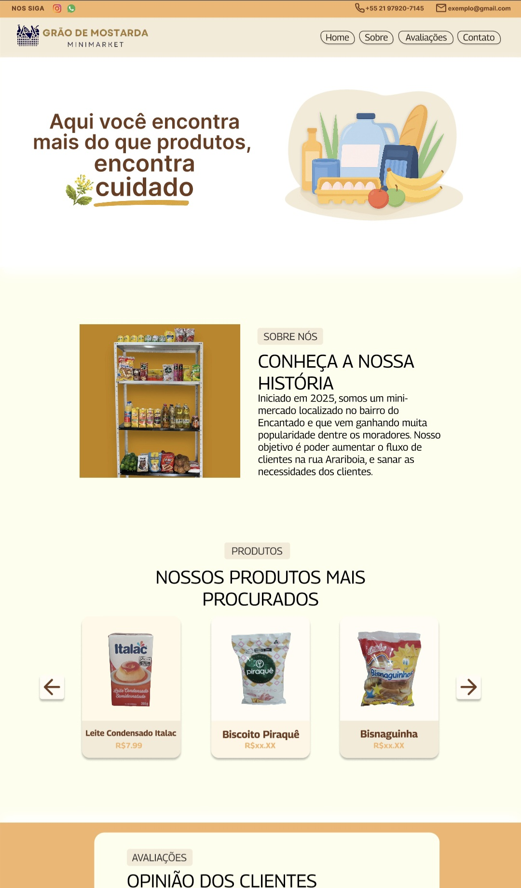

# 🛒 Grão de Mostarda — Site Institucional

Site institucional para o Grão de Mostarda, um mini-mercado localizado no bairro do Encantado (RJ). O site apresenta a loja, seus produtos mais procurados e avaliações de clientes, com foco em usabilidade e identidade visual da marca. Projeto extensionista desenvolvido em equipe.

## Funcionalidades

- Barra de contato fixa com redes sociais (Instagram, WhatsApp) e telefone
- Menu de navegação com âncoras para as seções da página
- Seção "Sobre" contando a história do mercado
- Carrossel de produtos em destaque, navegável em grupos de 3 itens
- Carrossel de avaliações de clientes, com nome, foto e classificação em estrelas
- Rodapé com endereço, telefone, horário de funcionamento e redes sociais

## Tecnologias

- **HTML5** — estruturação semântica do conteúdo
- **CSS3** — estilização com variáveis customizadas (`:root`), Flexbox e Google Fonts (Georama e Inter)
- **JavaScript (Vanilla)** — manipulação de DOM e lógica dos carrosséis, sem uso de frameworks ou bibliotecas externas

## Como rodar

Por ser um site estático, basta abrir o `index.html` diretamente no navegador — não é necessário nenhum servidor ou instalação.

*(Opcional: usar a extensão "Live Server" do VS Code para recarregamento automático durante edições.)*

## Arquitetura

O projeto segue uma estrutura simples de página única (single page):

- **`index.html`** — toda a estrutura da página, dividida em seções semânticas: `header` (barra de contato + menu), `propaganda` (hero), `sobre`, `produtos`, `avaliacoes` e `footer`.
- **`style.css`** — estilos globais e por seção, organizados com comentários demarcando a contribuição de cada integrante da equipe (ex: `/*INICIO parte gabs*/`, `/*Início da parte do Pedro*/`), com paleta de cores centralizada em variáveis CSS (`--alaranjado`, `--marrom`, etc.).
- **`script.js`** — controla o comportamento dinâmico das duas seções interativas: o carrossel de produtos e o carrossel de avaliações.

## Decisões técnicas

- **Carrossel de produtos por grupos:** os produtos são organizados em um array de arrays (grupos de 3 itens), e a navegação alterna entre esses grupos de forma circular — ao chegar no último grupo, o botão "próximo" volta ao primeiro, e vice-versa.
- **Renderização via `innerHTML`:** tanto o carrossel de produtos quanto o HTML dos cartões são gerados dinamicamente em JavaScript a partir dos dados, evitando duplicação manual de marcação para cada produto.
- **Carrossel de avaliações com estrelas dinâmicas:** a quantidade de estrelas exibidas é gerada a partir do campo `estrelas` de cada avaliação, usando repetição de caractere (`'★'.repeat(...)`), em vez de estrelas fixas no HTML.
- **Paleta de cores centralizada:** todas as cores da marca foram definidas como variáveis CSS no `:root`, facilitando manutenção e consistência visual entre as seções feitas por diferentes integrantes da equipe.
- **Divisão de trabalho documentada no CSS:** os estilos foram comentados por autor/seção, o que ajudou a equipe a navegar no arquivo durante o desenvolvimento colaborativo.

## Status

Projeto concluído. Estrutura principal, estilos e carrosséis de produtos/avaliações já funcionais; ajustes de refinamento visual (ex: substituição de ícones por pseudo-elementos, padronização de fontes no rodapé) e organização do JavaScript do carrossel feitos e revisados em equipe. 
